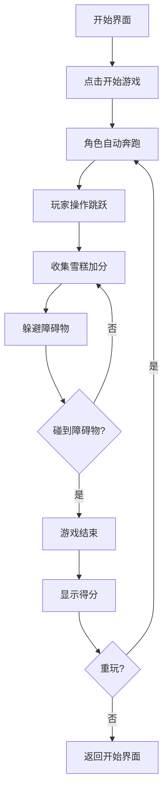

## 1. 产品概述

"张雪峰，快跑！"是一款以网络热梗为主题的休闲跑酷小游戏。玩家操控张雪峰在马拉松赛道上奔跑，通过吃雪糕补充能量，躲避各种障碍物，挑战最高分数。游戏融入热搜词条等流行元素，轻松有趣，适合碎片化时间娱乐。

- 核心玩法：横版跑酷，跳跃躲避 + 收集道具
- 目标用户：喜欢休闲小游戏、关注网络热梗的年轻用户
- 产品价值：用轻松幽默的方式再现网络热点，提供解压娱乐体验

## 2. 核心功能

### 2.1 用户角色
| 角色 | 注册方式 | 核心权限 |
|------|----------|----------|
| 玩家 | 无需注册，直接游玩 | 开始游戏、暂停、重玩、查看分数 |

### 2.2 功能模块
1. **开始界面**：游戏标题、开始按钮、操作说明、最高分显示
2. **游戏主界面**：角色奔跑、障碍物躲避、雪糕收集、热搜背景、分数显示
3. **结束界面**：本次得分、最高分、重新开始按钮

### 2.3 页面详情
| 页面名称 | 模块名称 | 功能描述 |
|----------|----------|----------|
| 开始界面 | 标题区 | 大字体游戏标题"张雪峰，快跑！"，副标题"吃雪糕跑马拉松" |
| 开始界面 | 操作说明 | 空格键/点击屏幕跳跃 |
| 开始界面 | 开始按钮 | 点击进入游戏 |
| 开始界面 | 最高分 | 本地存储的历史最高分 |
| 游戏主界面 | 游戏画布 | 角色、障碍物、雪糕、背景的渲染区域 |
| 游戏主界面 | 分数面板 | 实时显示当前分数、雪糕数量 |
| 游戏主界面 | 热搜背景 | 流动的热搜词条作为背景装饰 |
| 结束界面 | 得分展示 | 本次游戏得分和历史最高分 |
| 结束界面 | 重玩按钮 | 点击重新开始游戏 |

## 3. 核心流程

玩家进入游戏 → 点击开始按钮 → 张雪峰自动向前跑 → 玩家按空格/点击跳跃 → 收集雪糕加分 → 躲避障碍物 → 碰到障碍物游戏结束 → 显示得分 → 可选择重玩

## 4. 用户界面设计

### 4.1 设计风格
- **主色调**：明亮活泼的橙黄色系（#FF6B35、#FFD93D），搭配天蓝色背景（#87CEEB）
- **按钮风格**：圆角矩形按钮，带有渐变和阴影，悬停有放大动效
- **字体**：使用圆润可爱的无衬线字体，标题使用粗体大字
- **布局风格**：居中卡片式布局，游戏画布占主要区域
- **图标/emoji**：使用 🏃‍♂️🍦🎯 等 emoji 增强趣味性

### 4.2 页面设计概览
| 页面名称 | 模块名称 | UI 元素 |
|----------|----------|---------|
| 开始界面 | 标题区 | 渐变文字、弹跳动画、雪糕和跑步 emoji 装饰 |
| 开始界面 | 开始按钮 | 橙黄渐变、圆角、阴影、hover 放大效果 |
| 游戏主界面 | 游戏画布 | 蓝天背景、地面、角色像素化风格、流畅动画 |
| 游戏主界面 | 分数面板 | 半透明黑底、白字、左上角固定 |
| 结束界面 | 结果卡片 | 白色圆角卡片、阴影、居中显示 |

### 4.3 响应式
- 桌面端优先，游戏画布固定宽度 800px
- 移动端自适应，游戏画布宽度占满屏幕
- 支持触屏点击操作

### 4.4 游戏视觉风格
- 像素/卡通混合风格，角色可爱化
- 背景有流动的热搜词条，增加热点氛围
- 雪糕闪烁发光，吸引玩家收集
- 障碍物样式多样化（书本、话筒、分数线等）
