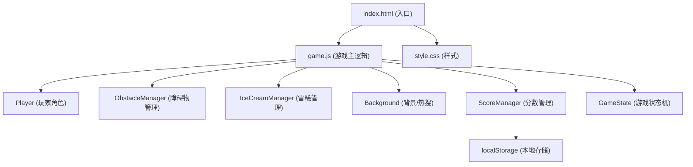

## 1. 架构设计



## 2. 技术选型

- **前端技术**：纯 HTML5 + CSS3 + JavaScript (ES6+)
- **渲染引擎**：HTML5 Canvas 2D
- **构建工具**：无需构建，原生运行
- **数据存储**：localStorage 存储最高分
- **动画**：requestAnimationFrame 实现 60fps 流畅动画

## 3. 游戏文件结构

| 文件 | 作用 |
|------|------|
| `game/index.html` | 游戏入口页面，包含 Canvas 和 UI 元素 |
| `game/style.css` | 游戏样式，包括开始/结束界面、按钮等 |
| `game/game.js` | 游戏主逻辑，所有游戏代码 |

## 4. 核心数据结构

### 4.1 玩家 (Player)
```javascript
{
  x: number,           // x 坐标
  y: number,           // y 坐标
  width: number,       // 宽度
  height: number,      // 高度
  velocityY: number,   // 垂直速度
  isJumping: boolean,  // 是否在跳跃
  frame: number,       // 奔跑动画帧
}
```

### 4.2 障碍物 (Obstacle)
```javascript
{
  x: number,
  y: number,
  width: number,
  height: number,
  type: string,  // 'book', 'microphone', 'scoreline'
  speed: number,
}
```

### 4.3 雪糕 (IceCream)
```javascript
{
  x: number,
  y: number,
  width: number,
  height: number,
  collected: boolean,
  glowPhase: number,  // 闪烁动画相位
}
```

### 4.4 游戏状态
```javascript
{
  state: 'start' | 'playing' | 'gameover',
  score: number,
  iceCreams: number,
  highScore: number,
  speed: number,      // 游戏速度，随时间增加
}
```

## 5. 核心游戏逻辑

### 5.1 物理系统
- 重力：角色受重力影响下落
- 跳跃：按空格/点击给角色向上的初速度
- 地面检测：角色不能穿过地面

### 5.2 碰撞检测
- AABB 矩形碰撞检测
- 玩家与障碍物碰撞 → 游戏结束
- 玩家与雪糕碰撞 → 收集雪糕加分

### 5.3 难度递增
- 游戏速度随时间/分数逐渐加快
- 障碍物生成频率逐渐提高
- 障碍物类型逐渐多样化

### 5.4 分数系统
- 基础分：每秒自动增加
- 雪糕分：收集一个雪糕 +50 分
- 最高分：localStorage 持久化存储

## 6. 热搜词条列表

游戏背景中流动的热搜词条（随机选取）：
- "#张雪峰吃雪糕跑马拉松#"
- "#考研名师的夏日挑战#"
- "#雪糕刺客退退退#"
- "#马拉松还能这么玩#"
- "#夏日解暑神器#"
- "#报志愿不如吃雪糕#"
- "#这波操作666#"
- "#是谁的青春回来了#"
